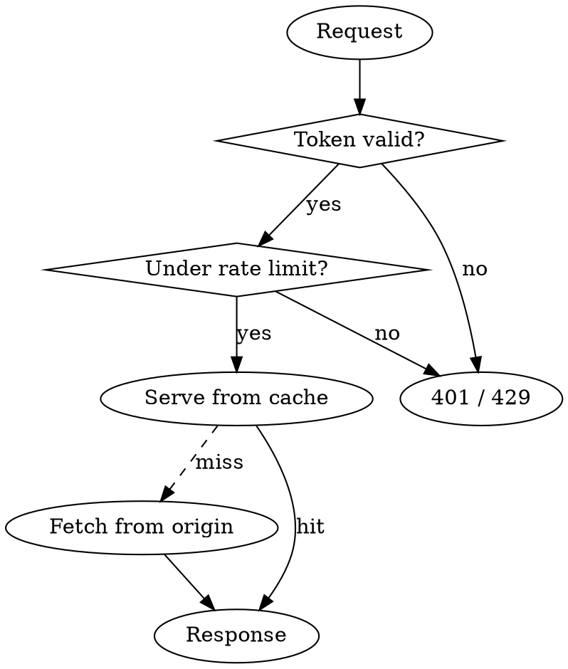
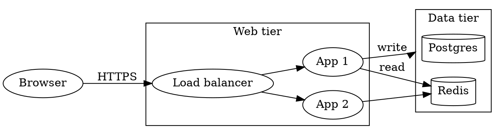
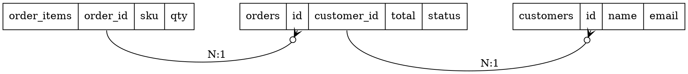
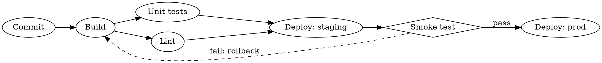
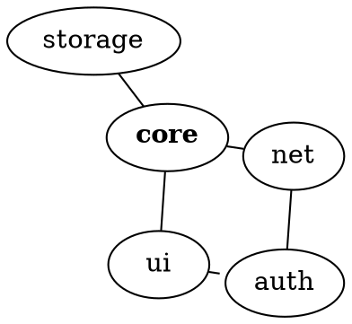

<div class="doc paper clean"></div>

# Graphviz showcase

Themed `dot` fences: **no colors, fonts or sizes** — the style marker on line 1
does that. For a fully styled standalone version (colors, HTML tables, records,
ports, clusters, legend) see `graphviz-showcase.dot` next to this file.

Render the standalone file anywhere:

```bash
dot -Tsvg graphviz-showcase.dot -o graphviz-showcase.svg
dot -Tpng -Gdpi=150 graphviz-showcase.dot -o graphviz-showcase.png
```

## 1. Decision flow with labelled edges



## 2. Architecture with clusters



## 3. Records and ports (data model)



## 4. Pipeline with same-rank stages and a back edge



## 5. Dependency graph (undirected + HTML label)



## Cheat sheet

| Feature | Syntax |
|---|---|
| Direction | `rankdir=LR` (also TB, BT, RL) |
| Group | `subgraph cluster_x { label="X"; ... }` |
| Same row/column | `{ rank=same; a; b; }` |
| Edge between clusters | `compound=true` + `lhead=cluster_x` / `ltail=` |
| Ignore edge in layout | `constraint=false` |
| Port on record/HTML | `a:port -> b:port` |
| Invisible spacer | `a -> b [style=invis]` |
| Other engines | `layout=neato / fdp / circo / twopi` |
